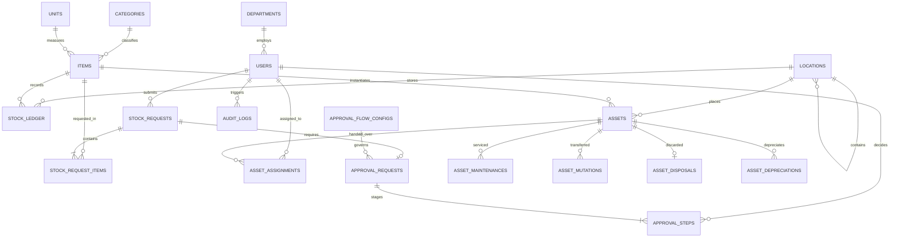

# DATABASE SPECIFICATION & SCHEMA DICTIONARY
**Inventory & Asset Management System**  
*Document Version: 1.0.0 | Phase: 05 - Database Design | Date: 2026-09-18*

---

## 1. Overview & Database Architecture

Dokumen ini mendefinisikan skema lengkap basis data relasional untuk sistem Inventory & Asset Management.
- **RDBMS**: MySQL 8.0+
- **Storage Engine**: InnoDB (Foreign Key integrity, ACID transactions, row-level locking)
- **Default Character Set**: `utf8mb4`
- **Default Collation**: `utf8mb4_unicode_ci`
- **Deletion Paradigm**: **Zero Soft Deletes** — menggunakan status flag `is_active` (boolean) untuk master data, dan record permanen (immutable) untuk ledger audit dan transaksi.

---

## 2. Entity Relationship Diagram (High-Level)

---

## 3. Master Data Tables

### 3.1 `departments`
Menyimpan master departemen atau divisi organisasi.

| Column | Type | Nullable | Default | Description / Constraints |
|---|---|---|---|---|
| `id` | BIGINT UNSIGNED | No | AUTO_INCREMENT | Primary Key |
| `code` | VARCHAR(20) | No | - | Kode unik departemen (e.g., `DEP-IT`) |
| `name` | VARCHAR(100) | No | - | Nama departemen |
| `description` | VARCHAR(255) | Yes | NULL | Keterangan tambahan |
| `is_active` | BOOLEAN | No | 1 | Status aktif departemen |
| `created_at` | TIMESTAMP | Yes | CURRENT_TIMESTAMP | - |
| `updated_at` | TIMESTAMP | Yes | CURRENT_TIMESTAMP | ON UPDATE CURRENT_TIMESTAMP |

- **Indexes**:
  - `PRIMARY KEY (id)`
  - `UNIQUE idx_departments_code (code)`
  - `INDEX idx_departments_is_active (is_active)`

---

### 3.2 `categories`
Kategori hierarkis atau flat untuk pengelompokan barang dan aset.

| Column | Type | Nullable | Default | Description / Constraints |
|---|---|---|---|---|
| `id` | BIGINT UNSIGNED | No | AUTO_INCREMENT | Primary Key |
| `code` | VARCHAR(20) | No | - | Kode kategori (e.g., `CAT-ELEK`) |
| `name` | VARCHAR(100) | No | - | Nama kategori |
| `type` | ENUM('inventory', 'asset', 'both') | No | 'both' | Cakupan peruntukan kategori |
| `description` | VARCHAR(255) | Yes | NULL | Keterangan |
| `is_active` | BOOLEAN | No | 1 | Status aktif |
| `created_at` | TIMESTAMP | Yes | CURRENT_TIMESTAMP | - |
| `updated_at` | TIMESTAMP | Yes | CURRENT_TIMESTAMP | ON UPDATE CURRENT_TIMESTAMP |

- **Indexes**:
  - `PRIMARY KEY (id)`
  - `UNIQUE idx_categories_code (code)`
  - `INDEX idx_categories_type_active (type, is_active)`

---

### 3.3 `units`
Master satuan pengukuran barang (UOM - Unit of Measure).

| Column | Type | Nullable | Default | Description / Constraints |
|---|---|---|---|---|
| `id` | BIGINT UNSIGNED | No | AUTO_INCREMENT | Primary Key |
| `code` | VARCHAR(10) | No | - | Kode satuan (e.g., `PCS`, `BOX`, `UNIT`, `KG`) |
| `name` | VARCHAR(50) | No | - | Nama satuan (e.g., `Pieces`, `Kilogram`) |
| `is_active` | BOOLEAN | No | 1 | Status aktif |
| `created_at` | TIMESTAMP | Yes | CURRENT_TIMESTAMP | - |
| `updated_at` | TIMESTAMP | Yes | CURRENT_TIMESTAMP | ON UPDATE CURRENT_TIMESTAMP |

- **Indexes**:
  - `PRIMARY KEY (id)`
  - `UNIQUE idx_units_code (code)`

---

### 3.4 `locations`
Menyimpan lokasi fisik (Gudang, Gedung, Ruangan) dengan struktur hierarki 2-level (Parent-Child).

| Column | Type | Nullable | Default | Description / Constraints |
|---|---|---|---|---|
| `id` | BIGINT UNSIGNED | No | AUTO_INCREMENT | Primary Key |
| `parent_id` | BIGINT UNSIGNED | Yes | NULL | ID lokasi induk (Gedung/Gudang utama) |
| `code` | VARCHAR(20) | No | - | Kode unik lokasi (e.g., `LOC-WH1-R02`) |
| `name` | VARCHAR(100) | No | - | Nama lokasi / ruangan |
| `type` | ENUM('building', 'warehouse', 'room', 'area') | No | 'room' | Jenis lokasi fisik |
| `address` | TEXT | Yes | NULL | Alamat fisik jika lokasi induk |
| `is_active` | BOOLEAN | No | 1 | Flag aktif (Lokasi tidak boleh di-hard delete) |
| `created_at` | TIMESTAMP | Yes | CURRENT_TIMESTAMP | - |
| `updated_at` | TIMESTAMP | Yes | CURRENT_TIMESTAMP | ON UPDATE CURRENT_TIMESTAMP |

- **Foreign Keys**:
  - `fk_locations_parent_id`: `FOREIGN KEY (parent_id) REFERENCES locations(id) ON DELETE RESTRICT ON UPDATE CASCADE`
- **Indexes**:
  - `PRIMARY KEY (id)`
  - `UNIQUE idx_locations_code (code)`
  - `INDEX idx_locations_parent_id (parent_id)`
  - `INDEX idx_locations_is_active (is_active)`

---

### 3.5 `items`
Katalog master barang yang mendefinisikan item inventory maupun template aset.

| Column | Type | Nullable | Default | Description / Constraints |
|---|---|---|---|---|
| `id` | BIGINT UNSIGNED | No | AUTO_INCREMENT | Primary Key |
| `category_id` | BIGINT UNSIGNED | No | - | FK ke `categories.id` |
| `unit_id` | BIGINT UNSIGNED | No | - | FK ke `units.id` |
| `item_code` | VARCHAR(30) | No | - | Kode unik barang (e.g., `ITM-2026-0001`) |
| `name` | VARCHAR(150) | No | - | Nama barang / merek / spesifikasi umum |
| `barcode` | VARCHAR(50) | Yes | NULL | Barcode / EAN jika tersedia |
| `description` | TEXT | Yes | NULL | Deskripsi barang |
| `minimum_stock` | DECIMAL(12, 2) | No | 0.00 | Batas stok minimum untuk alert reorder |
| `standard_cost` | DECIMAL(15, 2) | No | 0.00 | Estimasi harga beli standar (IDR) |
| `can_be_inventory` | BOOLEAN | No | 1 | Dapat dikelola sebagai consumable/stock |
| `can_be_asset` | BOOLEAN | No | 0 | Dapat diregistrasikan sebagai aset tetap |
| `is_active` | BOOLEAN | No | 1 | Status aktif master item |
| `created_at` | TIMESTAMP | Yes | CURRENT_TIMESTAMP | - |
| `updated_at` | TIMESTAMP | Yes | CURRENT_TIMESTAMP | ON UPDATE CURRENT_TIMESTAMP |

- **Foreign Keys**:
  - `fk_items_category_id`: `FOREIGN KEY (category_id) REFERENCES categories(id) ON DELETE RESTRICT`
  - `fk_items_unit_id`: `FOREIGN KEY (unit_id) REFERENCES units(id) ON DELETE RESTRICT`
- **Indexes**:
  - `PRIMARY KEY (id)`
  - `UNIQUE idx_items_item_code (item_code)`
  - `UNIQUE idx_items_barcode (barcode)`
  - `INDEX idx_items_category_id (category_id)`
  - `INDEX idx_items_type_flags (can_be_inventory, can_be_asset, is_active)`

---

### 3.6 `item_specifications`
Spesifikasi teknis dinamis berbasis pasangan key-value untuk suatu item.

| Column | Type | Nullable | Default | Description / Constraints |
|---|---|---|---|---|
| `id` | BIGINT UNSIGNED | No | AUTO_INCREMENT | Primary Key |
| `item_id` | BIGINT UNSIGNED | No | - | FK ke `items.id` |
| `spec_key` | VARCHAR(50) | No | - | Nama parameter (e.g., `RAM`, `Storage`, `Color`) |
| `spec_value` | VARCHAR(150) | No | - | Nilai parameter (e.g., `16GB`, `512GB NVMe`) |
| `created_at` | TIMESTAMP | Yes | CURRENT_TIMESTAMP | - |
| `updated_at` | TIMESTAMP | Yes | CURRENT_TIMESTAMP | ON UPDATE CURRENT_TIMESTAMP |

- **Foreign Keys**:
  - `fk_item_specifications_item_id`: `FOREIGN KEY (item_id) REFERENCES items(id) ON DELETE CASCADE`
- **Indexes**:
  - `PRIMARY KEY (id)`
  - `INDEX idx_item_specifications_item_key (item_id, spec_key)`

---

## 4. User, Authentication & RBAC Tables

### 4.1 `users`
Data akun pengguna dan pegawai.

| Column | Type | Nullable | Default | Description / Constraints |
|---|---|---|---|---|
| `id` | BIGINT UNSIGNED | No | AUTO_INCREMENT | Primary Key |
| `department_id` | BIGINT UNSIGNED | Yes | NULL | FK ke `departments.id` |
| `name` | VARCHAR(100) | No | - | Nama lengkap pegawai |
| `email` | VARCHAR(100) | No | - | Email korporat unik untuk login |
| `password` | VARCHAR(255) | No | - | Hash bcrypt/argon2 |
| `phone_number` | VARCHAR(20) | Yes | NULL | Nomor telepon/WhatsApp |
| `employee_id` | VARCHAR(30) | Yes | NULL | NIP / Nomor Induk Pegawai |
| `is_active` | BOOLEAN | No | 1 | Status aktif (False = blokir login) |
| `remember_token` | VARCHAR(100) | Yes | NULL | Token sesi remember-me |
| `created_at` | TIMESTAMP | Yes | CURRENT_TIMESTAMP | - |
| `updated_at` | TIMESTAMP | Yes | CURRENT_TIMESTAMP | ON UPDATE CURRENT_TIMESTAMP |

- **Foreign Keys**:
  - `fk_users_department_id`: `FOREIGN KEY (department_id) REFERENCES departments(id) ON DELETE RESTRICT`
- **Indexes**:
  - `PRIMARY KEY (id)`
  - `UNIQUE idx_users_email (email)`
  - `UNIQUE idx_users_employee_id (employee_id)`
  - `INDEX idx_users_is_active (is_active)`

---

### 4.2 Spatie Permission Tables (`roles`, `permissions`, `model_has_roles`, etc.)
Mengikuti struktur standar resmi paket `spatie/laravel-permission`:

- `roles`: `id`, `name`, `guard_name` ('web'), `created_at`, `updated_at`
- `permissions`: `id`, `name`, `guard_name` ('web'), `created_at`, `updated_at`
- `model_has_roles`: `role_id`, `model_type` ('App\Models\User'), `model_id`
- `model_has_permissions`: `permission_id`, `model_type`, `model_id`
- `role_has_permissions`: `permission_id`, `role_id`

---

## 5. Inventory Transaction Tables

### 5.1 `stock_ledger`
**Tabel Utama Ledger Stok (Event-Based Immutable Ledger)**. Setiap transaksi barang masuk/keluar/transfer HANYA dicatat melalui penambahan baris (INSERT ONLY). Nilai stok riil adalah `SUM(quantity)` dikelompokkan berdasarkan `item_id` dan `location_id`.

| Column | Type | Nullable | Default | Description / Constraints |
|---|---|---|---|---|
| `id` | BIGINT UNSIGNED | No | AUTO_INCREMENT | Primary Key |
| `item_id` | BIGINT UNSIGNED | No | - | FK ke `items.id` |
| `location_id` | BIGINT UNSIGNED | No | - | FK ke `locations.id` |
| `transaction_type` | ENUM('in_purchase', 'in_direct', 'in_adjustment', 'in_transfer', 'out_requisition', 'out_transfer', 'out_disposal', 'out_adjustment') | No | - | Jenis transaksi stok |
| `reference_type` | VARCHAR(50) | Yes | NULL | Model sumber (`goods_receipts`, `stock_requests`, dll.) |
| `reference_id` | BIGINT UNSIGNED | Yes | NULL | ID dokumen sumber |
| `quantity` | DECIMAL(12, 2) | No | - | Nilai perubahan stok (+ untuk masuk, - untuk keluar) |
| `unit_cost` | DECIMAL(15, 2) | No | 0.00 | Biaya per unit saat transaksi (untuk kalkulasi valuasi) |
| `balance_after` | DECIMAL(12, 2) | No | 0.00 | Saldo snapshot kalkulasi lokal saat event |
| `notes` | VARCHAR(255) | Yes | NULL | Keterangan transaksi |
| `created_by` | BIGINT UNSIGNED | No | - | FK ke `users.id` yang melakukan transaksi |
| `created_at` | TIMESTAMP | No | CURRENT_TIMESTAMP | Waktu pencatatan ledger (Immutable) |

- **Foreign Keys**:
  - `fk_stock_ledger_item_id`: `FOREIGN KEY (item_id) REFERENCES items(id) ON DELETE RESTRICT`
  - `fk_stock_ledger_location_id`: `FOREIGN KEY (location_id) REFERENCES locations(id) ON DELETE RESTRICT`
  - `fk_stock_ledger_created_by`: `FOREIGN KEY (created_by) REFERENCES users(id) ON DELETE RESTRICT`
- **Indexes**:
  - `PRIMARY KEY (id)`
  - `INDEX idx_stock_ledger_balance (item_id, location_id)`
  - `INDEX idx_stock_ledger_timeline (item_id, location_id, created_at)`
  - `INDEX idx_stock_ledger_reference (reference_type, reference_id)`
  - `INDEX idx_stock_ledger_type (transaction_type)`

---

### 5.2 `stock_requests` & `stock_request_items`
Dokumen permintaan barang/atk oleh Requester.

#### `stock_requests`
| Column | Type | Nullable | Default | Description / Constraints |
|---|---|---|---|---|
| `id` | BIGINT UNSIGNED | No | AUTO_INCREMENT | Primary Key |
| `request_number` | VARCHAR(30) | No | - | Format: `REQ-YYYYMM-XXXX` |
| `requester_id` | BIGINT UNSIGNED | No | - | FK ke `users.id` pemohon |
| `department_id` | BIGINT UNSIGNED | No | - | FK ke `departments.id` |
| `destination_location_id` | BIGINT UNSIGNED | Yes | NULL | FK ke `locations.id` tujuan pemakaian |
| `purpose` | TEXT | No | - | Keperluan peminjaman/pemakaian |
| `status` | ENUM('draft', 'submitted', 'pending_l1', 'pending_l2', 'approved', 'rejected', 'fulfilled', 'cancelled') | No | 'draft' | Status siklus permintaan |
| `rejection_reason` | TEXT | Yes | NULL | Alasan jika ditolak |
| `created_at` | TIMESTAMP | Yes | CURRENT_TIMESTAMP | - |
| `updated_at` | TIMESTAMP | Yes | CURRENT_TIMESTAMP | ON UPDATE CURRENT_TIMESTAMP |

#### `stock_request_items`
| Column | Type | Nullable | Default | Description / Constraints |
|---|---|---|---|---|
| `id` | BIGINT UNSIGNED | No | AUTO_INCREMENT | Primary Key |
| `stock_request_id` | BIGINT UNSIGNED | No | - | FK ke `stock_requests.id` |
| `item_id` | BIGINT UNSIGNED | No | - | FK ke `items.id` |
| `quantity_requested` | DECIMAL(12, 2) | No | - | Jumlah yang diminta |
| `quantity_approved` | DECIMAL(12, 2) | Yes | NULL | Jumlah yang disetujui approver |
| `quantity_fulfilled` | DECIMAL(12, 2) | No | 0.00 | Jumlah yang sudah diserahkan |
| `notes` | VARCHAR(255) | Yes | NULL | Catatan spesifik per baris barang |

- **Foreign Keys**:
  - `stock_request_items.stock_request_id` -> `stock_requests.id` ON DELETE CASCADE
  - `stock_request_items.item_id` -> `items.id` ON DELETE RESTRICT

---

### 5.3 `stock_transfers` & `stock_transfer_items`
Dokumen perpindahan stok fisik antar dua lokasi / gudang.

#### `stock_transfers`
| Column | Type | Nullable | Default | Description / Constraints |
|---|---|---|---|---|
| `id` | BIGINT UNSIGNED | No | AUTO_INCREMENT | Primary Key |
| `transfer_number` | VARCHAR(30) | No | - | Format: `TRF-YYYYMM-XXXX` |
| `source_location_id` | BIGINT UNSIGNED | No | - | Lokasi asal |
| `destination_location_id` | BIGINT UNSIGNED | No | - | Lokasi tujuan |
| `status` | ENUM('draft', 'in_transit', 'received', 'cancelled') | No | 'draft' | Status perpindahan |
| `sent_by` | BIGINT UNSIGNED | Yes | NULL | User yang mengirim |
| `sent_at` | TIMESTAMP | Yes | NULL | Waktu dikirim |
| `received_by` | BIGINT UNSIGNED | Yes | NULL | User yang menerima di tujuan |
| `received_at` | TIMESTAMP | Yes | NULL | Waktu diterima |
| `notes` | TEXT | Yes | NULL | Keterangan transfer |
| `created_at` | TIMESTAMP | Yes | CURRENT_TIMESTAMP | - |
| `updated_at` | TIMESTAMP | Yes | CURRENT_TIMESTAMP | ON UPDATE CURRENT_TIMESTAMP |

#### `stock_transfer_items`
| Column | Type | Nullable | Default | Description / Constraints |
|---|---|---|---|---|
| `id` | BIGINT UNSIGNED | No | AUTO_INCREMENT | Primary Key |
| `stock_transfer_id` | BIGINT UNSIGNED | No | - | FK ke `stock_transfers.id` |
| `item_id` | BIGINT UNSIGNED | No | - | FK ke `items.id` |
| `quantity_sent` | DECIMAL(12, 2) | No | - | Kuantitas yang dikirim |
| `quantity_received` | DECIMAL(12, 2) | Yes | NULL | Kuantitas aktual yang diterima |

---

### 5.4 `stock_adjustments` & `stock_adjustment_items`
Dokumen penyesuaian/koreksi selisih stok (rusak, hilang, penyesuaian audit).

#### `stock_adjustments`
| Column | Type | Nullable | Default | Description / Constraints |
|---|---|---|---|---|
| `id` | BIGINT UNSIGNED | No | AUTO_INCREMENT | Primary Key |
| `adjustment_number` | VARCHAR(30) | No | - | Format: `ADJ-YYYYMM-XXXX` |
| `location_id` | BIGINT UNSIGNED | No | - | Lokasi yang disesuaikan |
| `reason` | VARCHAR(255) | No | - | Alasan penyesuaian |
| `status` | ENUM('draft', 'pending_approval', 'approved', 'rejected') | No | 'draft' | Status persetujuan |
| `created_by` | BIGINT UNSIGNED | No | - | FK ke `users.id` |
| `created_at` | TIMESTAMP | Yes | CURRENT_TIMESTAMP | - |
| `updated_at` | TIMESTAMP | Yes | CURRENT_TIMESTAMP | ON UPDATE CURRENT_TIMESTAMP |

#### `stock_adjustment_items`
| Column | Type | Nullable | Default | Description / Constraints |
|---|---|---|---|---|
| `id` | BIGINT UNSIGNED | No | AUTO_INCREMENT | Primary Key |
| `stock_adjustment_id` | BIGINT UNSIGNED | No | - | FK ke `stock_adjustments.id` |
| `item_id` | BIGINT UNSIGNED | No | - | FK ke `items.id` |
| `book_quantity` | DECIMAL(12, 2) | No | - | Stok tercatat di sistem sebelum koreksi |
| `actual_quantity` | DECIMAL(12, 2) | No | - | Stok fisik aktual dihitung |
| `difference` | DECIMAL(12, 2) | No | - | `actual_quantity - book_quantity` |

---

## 6. Asset Management Tables

### 6.1 `assets`
Pencatatan aset individual / unit bernomor seri dengan kode unik.

| Column | Type | Nullable | Default | Description / Constraints |
|---|---|---|---|---|
| `id` | BIGINT UNSIGNED | No | AUTO_INCREMENT | Primary Key |
| `asset_code` | VARCHAR(30) | No | - | Kode inventaris/QR (e.g., `AST-2026-00045`) |
| `item_id` | BIGINT UNSIGNED | No | - | FK ke master `items.id` |
| `location_id` | BIGINT UNSIGNED | No | - | Lokasi penempatan saat ini |
| `assigned_to` | BIGINT UNSIGNED | Yes | NULL | FK ke `users.id` (pegawai pemegang) |
| `serial_number` | VARCHAR(100) | Yes | NULL | Nomor seri pabrik (Unik jika diisi) |
| `purchase_date` | DATE | Yes | NULL | Tanggal perolehan aset |
| `purchase_cost` | DECIMAL(15, 2) | No | 0.00 | Nilai pembelian aset (IDR) |
| `useful_life_years` | INT UNSIGNED | No | 4 | Estimasi masa manfaat (tahun) untuk depresiasi |
| `salvage_value` | DECIMAL(15, 2) | No | 0.00 | Nilai sisa / residu di akhir masa manfaat |
| `current_book_value`| DECIMAL(15, 2) | No | 0.00 | Nilai buku terkini setelah penyusutan |
| `warranty_expiry` | DATE | Yes | NULL | Tanggal batas garansi pabrik/vendor |
| `status` | ENUM('available', 'in_use', 'maintenance', 'disposed', 'lost') | No | 'available' | Status operasional aset |
| `condition` | ENUM('good', 'minor_damage', 'major_damage', 'scrapped') | No | 'good' | Kondisi fisik aset |
| `qr_code_path` | VARCHAR(255) | Yes | NULL | File path gambar QR code yang digenerate |
| `photo_path` | VARCHAR(255) | Yes | NULL | Foto fisik aset |
| `is_active` | BOOLEAN | No | 1 | Status aktif (False jika dihapus dari sistem) |
| `created_at` | TIMESTAMP | Yes | CURRENT_TIMESTAMP | - |
| `updated_at` | TIMESTAMP | Yes | CURRENT_TIMESTAMP | ON UPDATE CURRENT_TIMESTAMP |

- **Foreign Keys**:
  - `fk_assets_item_id`: `FOREIGN KEY (item_id) REFERENCES items(id) ON DELETE RESTRICT`
  - `fk_assets_location_id`: `FOREIGN KEY (location_id) REFERENCES locations(id) ON DELETE RESTRICT`
  - `fk_assets_assigned_to`: `FOREIGN KEY (assigned_to) REFERENCES users(id) ON DELETE SET NULL`
- **Indexes**:
  - `PRIMARY KEY (id)`
  - `UNIQUE idx_assets_asset_code (asset_code)`
  - `UNIQUE idx_assets_serial_number (serial_number)`
  - `INDEX idx_assets_status_condition (status, condition)`
  - `INDEX idx_assets_location_id (location_id)`
  - `INDEX idx_assets_assigned_to (assigned_to)`
  - `INDEX idx_assets_warranty_expiry (warranty_expiry)`

---

### 6.2 `asset_assignments`
Histori serah terima pemakaian aset (Check-out & Check-in).

| Column | Type | Nullable | Default | Description / Constraints |
|---|---|---|---|---|
| `id` | BIGINT UNSIGNED | No | AUTO_INCREMENT | Primary Key |
| `asset_id` | BIGINT UNSIGNED | No | - | FK ke `assets.id` |
| `user_id` | BIGINT UNSIGNED | No | - | FK ke `users.id` (penerima aset) |
| `checkout_date` | DATETIME | No | - | Tanggal/waktu penyerahan aset |
| `expected_return_date`| DATE | Yes | NULL | Target pengembalian jika bersifat pinjam sementara |
| `return_date` | DATETIME | Yes | NULL | Tanggal pengembalian aktual (NULL = masih dipegang) |
| `condition_out` | VARCHAR(100) | No | 'good' | Kondisi saat check-out |
| `condition_in` | VARCHAR(100) | Yes | NULL | Kondisi saat check-in kembali |
| `checkout_notes` | TEXT | Yes | NULL | Catatan saat serah terima |
| `return_notes` | TEXT | Yes | NULL | Catatan saat pengembalian |
| `assigned_by` | BIGINT UNSIGNED | No | - | Staff yang memproses serah terima |
| `received_by` | BIGINT UNSIGNED | Yes | NULL | Staff yang memproses pengembalian |
| `created_at` | TIMESTAMP | Yes | CURRENT_TIMESTAMP | - |
| `updated_at` | TIMESTAMP | Yes | CURRENT_TIMESTAMP | ON UPDATE CURRENT_TIMESTAMP |

- **Indexes**:
  - `PRIMARY KEY (id)`
  - `INDEX idx_asset_assignments_active (asset_id, return_date)`
  - `INDEX idx_asset_assignments_user (user_id)`

---

### 6.3 `asset_maintenances`
Pencatatan perbaikan, servis berkala, atau kalibrasi aset.

| Column | Type | Nullable | Default | Description / Constraints |
|---|---|---|---|---|
| `id` | BIGINT UNSIGNED | No | AUTO_INCREMENT | Primary Key |
| `maintenance_number` | VARCHAR(30) | No | - | Format: `MNT-YYYYMM-XXXX` |
| `asset_id` | BIGINT UNSIGNED | No | - | FK ke `assets.id` |
| `scheduled_date` | DATE | No | - | Tanggal jadwal maintenance |
| `completion_date` | DATE | Yes | NULL | Tanggal selesai pengerjaan |
| `vendor_name` | VARCHAR(100) | Yes | NULL | Pihak ketiga / bengkel / vendor servis |
| `cost` | DECIMAL(15, 2) | No | 0.00 | Biaya perbaikan (IDR) |
| `status` | ENUM('scheduled', 'in_progress', 'completed', 'cancelled') | No | 'scheduled' | Status servis |
| `issue_description` | TEXT | No | - | Keluhan / kerusakan |
| `action_taken` | TEXT | Yes | NULL | Tindakan yang dilakukan |
| `created_by` | BIGINT UNSIGNED | No | - | FK ke `users.id` |
| `created_at` | TIMESTAMP | Yes | CURRENT_TIMESTAMP | - |
| `updated_at` | TIMESTAMP | Yes | CURRENT_TIMESTAMP | ON UPDATE CURRENT_TIMESTAMP |

---

### 6.4 `asset_disposals`
Dokumen pelepasan/pemusnahan aset tetap yang rusak berat, hilang, atau usang.

| Column | Type | Nullable | Default | Description / Constraints |
|---|---|---|---|---|
| `id` | BIGINT UNSIGNED | No | AUTO_INCREMENT | Primary Key |
| `disposal_number` | VARCHAR(30) | No | - | Format: `DSP-YYYYMM-XXXX` |
| `asset_id` | BIGINT UNSIGNED | No | - | FK ke `assets.id` |
| `disposal_date` | DATE | No | - | Tanggal efektif pelepasan aset |
| `method` | ENUM('discarded', 'sold', 'donated', 'destroyed') | No | 'discarded' | 4 Metode disposal resmi |
| `reason` | TEXT | No | - | Justifikasi pelepasan aset |
| `proceeds` | DECIMAL(15, 2) | No | 0.00 | Hasil penjualan jika metode = `sold` |
| `disposal_cost` | DECIMAL(15, 2) | No | 0.00 | Biaya penghapusan / biaya lelang |
| `documentation_path`| VARCHAR(255) | Yes | NULL | Berita acara / dokumen foto pemusnahan |
| `approved_by` | BIGINT UNSIGNED | Yes | NULL | Manager/Admin yang mengesahkan |
| `created_by` | BIGINT UNSIGNED | No | - | FK ke `users.id` |
| `created_at` | TIMESTAMP | Yes | CURRENT_TIMESTAMP | - |
| `updated_at` | TIMESTAMP | Yes | CURRENT_TIMESTAMP | ON UPDATE CURRENT_TIMESTAMP |

---

### 6.5 `asset_depreciations`
Jadwal dan catatan historis penyusutan garis lurus (Straight-Line Depreciation).

| Column | Type | Nullable | Default | Description / Constraints |
|---|---|---|---|---|
| `id` | BIGINT UNSIGNED | No | AUTO_INCREMENT | Primary Key |
| `asset_id` | BIGINT UNSIGNED | No | - | FK ke `assets.id` |
| `period_year` | INT UNSIGNED | No | - | Tahun pembukuan (e.g., 2026) |
| `period_month` | TINYINT UNSIGNED | No | - | Bulan pembukuan (1 - 12) |
| `depreciation_amount`| DECIMAL(15, 2) | No | - | Nilai susut periode ini |
| `accumulated_amount` | DECIMAL(15, 2) | No | - | Akumulasi penyusutan hingga periode ini |
| `ending_book_value` | DECIMAL(15, 2) | No | - | Nilai buku sisa di akhir periode |
| `calculated_at` | TIMESTAMP | No | CURRENT_TIMESTAMP | Waktu kalkulasi sistem |

- **Indexes**:
  - `PRIMARY KEY (id)`
  - `UNIQUE idx_asset_depreciations_period (asset_id, period_year, period_month)`

---

## 7. Dynamic Approval Workflow Tables

### 7.1 `approval_flow_configs`
Konfigurasi level persetujuan dinamis yang dapat diatur oleh Super Admin.

| Column | Type | Nullable | Default | Description / Constraints |
|---|---|---|---|---|
| `id` | BIGINT UNSIGNED | No | AUTO_INCREMENT | Primary Key |
| `transaction_type` | VARCHAR(50) | No | - | Modul (`stock_request`, `stock_adjustment`, `asset_disposal`) |
| `level` | INT UNSIGNED | No | 1 | Level tahapan (1 = Admin, 2 = Manager) |
| `approver_role` | VARCHAR(50) | No | - | Nama role yang berhak (`Admin`, `Manager`) |
| `is_mandatory` | BOOLEAN | No | 1 | Apakah tahapan ini wajib dilalui |
| `created_at` | TIMESTAMP | Yes | CURRENT_TIMESTAMP | - |
| `updated_at` | TIMESTAMP | Yes | CURRENT_TIMESTAMP | ON UPDATE CURRENT_TIMESTAMP |

- **Indexes**:
  - `PRIMARY KEY (id)`
  - `UNIQUE idx_approval_config_type_level (transaction_type, level)`

---

### 7.2 `approval_requests`
Instansi permintaan approval untuk suatu transaksi dokumen tertentu.

| Column | Type | Nullable | Default | Description / Constraints |
|---|---|---|---|---|
| `id` | BIGINT UNSIGNED | No | AUTO_INCREMENT | Primary Key |
| `transaction_type` | VARCHAR(50) | No | - | Model transaksi sumber (`stock_requests`, dll.) |
| `transaction_id` | BIGINT UNSIGNED | No | - | ID baris dokumen sumber |
| `current_level` | INT UNSIGNED | No | 1 | Level yang sedang aktif menunggu aksi |
| `total_levels` | INT UNSIGNED | No | 2 | Total tingkatan yang dibutuhkan |
| `status` | ENUM('pending', 'approved', 'rejected', 'cancelled') | No | 'pending' | Status keseluruhan alur |
| `created_by` | BIGINT UNSIGNED | No | - | Pemohon awal transaksi |
| `created_at` | TIMESTAMP | Yes | CURRENT_TIMESTAMP | - |
| `updated_at` | TIMESTAMP | Yes | CURRENT_TIMESTAMP | ON UPDATE CURRENT_TIMESTAMP |

- **Indexes**:
  - `PRIMARY KEY (id)`
  - `INDEX idx_approval_requests_target (transaction_type, transaction_id)`
  - `INDEX idx_approval_requests_status (status)`

---

### 7.3 `approval_steps`
Riwayat tindakan approver pada masing-masing tingkatan approval.

| Column | Type | Nullable | Default | Description / Constraints |
|---|---|---|---|---|
| `id` | BIGINT UNSIGNED | No | AUTO_INCREMENT | Primary Key |
| `approval_request_id` | BIGINT UNSIGNED | No | - | FK ke `approval_requests.id` |
| `level` | INT UNSIGNED | No | - | Tingkatan level (1, 2) |
| `approver_id` | BIGINT UNSIGNED | Yes | NULL | FK ke `users.id` yang memproses (NULL jika pending) |
| `status` | ENUM('pending', 'approved', 'rejected') | No | 'pending' | Keputusan approver |
| `notes` | TEXT | Yes | NULL | Catatan revisi atau alasan penolakan |
| `acted_at` | TIMESTAMP | Yes | NULL | Waktu tombol disetujui / ditolak ditekan |
| `created_at` | TIMESTAMP | Yes | CURRENT_TIMESTAMP | - |
| `updated_at` | TIMESTAMP | Yes | CURRENT_TIMESTAMP | ON UPDATE CURRENT_TIMESTAMP |

- **Indexes**:
  - `PRIMARY KEY (id)`
  - `INDEX idx_approval_steps_request (approval_request_id, level)`

---

## 8. Audit & System Setting Tables

### 8.1 `audit_logs`
**Tabel Audit Log Permanen (INSERT-ONLY)**. Merekam seluruh aktivitas pengguna dengan 9 kategori domain. Dilarang keras melakukan UPDATE atau DELETE pada tabel ini.

| Column | Type | Nullable | Default | Description / Constraints |
|---|---|---|---|---|
| `id` | BIGINT UNSIGNED | No | AUTO_INCREMENT | Primary Key |
| `user_id` | BIGINT UNSIGNED | Yes | NULL | FK ke `users.id` (NULL jika aksi sistem / guest) |
| `category` | ENUM('auth', 'inventory', 'asset', 'approval', 'master', 'system', 'user_management', 'report', 'setting') | No | - | 9 Kategori audit |
| `event_type` | VARCHAR(50) | No | - | `create`, `update`, `delete`, `approve`, `reject`, `export`, `login` |
| `auditable_type` | VARCHAR(100) | Yes | NULL | Class/Nama entity (e.g., `App\Models\Asset`) |
| `auditable_id` | BIGINT UNSIGNED | Yes | NULL | ID entity terkait |
| `old_values` | JSON | Yes | NULL | Snapshot data sebelum perubahan (masked password) |
| `new_values` | JSON | Yes | NULL | Snapshot data sesudah perubahan |
| `ip_address` | VARCHAR(45) | Yes | NULL | IPv4 / IPv6 client |
| `user_agent` | TEXT | Yes | NULL | Browser / Client signature |
| `created_at` | TIMESTAMP | No | CURRENT_TIMESTAMP | Waktu log (Immutable) |

- **Indexes**:
  - `PRIMARY KEY (id)`
  - `INDEX idx_audit_logs_user (user_id)`
  - `INDEX idx_audit_logs_category (category)`
  - `INDEX idx_audit_logs_target (auditable_type, auditable_id)`
  - `INDEX idx_audit_logs_date (created_at)`

---

### 8.2 `system_settings`
Pengaturan sistem berformat key-value yang dikelola oleh Super Admin.

| Column | Type | Nullable | Default | Description / Constraints |
|---|---|---|---|---|
| `id` | BIGINT UNSIGNED | No | AUTO_INCREMENT | Primary Key |
| `key` | VARCHAR(50) | No | - | Pengenal parameter (e.g., `company_name`, `stock_alert_email`) |
| `value` | TEXT | Yes | NULL | Nilai konfigurasi (string/JSON) |
| `type` | ENUM('string', 'boolean', 'number', 'json') | No | 'string' | Tipe data casting |
| `description` | VARCHAR(255) | Yes | NULL | Penjelasan konfigurasi |
| `updated_by` | BIGINT UNSIGNED | Yes | NULL | FK ke `users.id` terakhir yang mengubah |
| `created_at` | TIMESTAMP | Yes | CURRENT_TIMESTAMP | - |
| `updated_at` | TIMESTAMP | Yes | CURRENT_TIMESTAMP | ON UPDATE CURRENT_TIMESTAMP |

- **Indexes**:
  - `PRIMARY KEY (id)`
  - `UNIQUE idx_system_settings_key (key)`

---

## 9. Data Integrity & Lock Rules Checklist

1. **Pessimistic Locking on Stock Operations**:
   Operasi pengeluaran stok dari `stock_ledger` wajib menjalankan `lockForUpdate()` pada record stok sebelum verifikasi saldo minimum.
2. **Transaction Scoping**:
   Setiap alur multi-tabel (misal: Disetujuinya `stock_requests` -> pemotongan `stock_ledger` -> update status `stock_requests` -> penulisan `audit_logs`) WAJIB dibungkus dalam satu blok `DB::transaction()`.
3. **No Cascade on Critical Master**:
   Semua relasi Foreign Key ke `departments`, `locations`, `categories`, `items`, dan `users` berstatus `ON DELETE RESTRICT` untuk mencegah cascade deletion yang tidak disengaja.

---
*Phase 05 Completed. Next Step: Phase 07 — Authorization Matrix & Policies (`docs/07_PERMISSION_MATRIX.md` expansion)*
